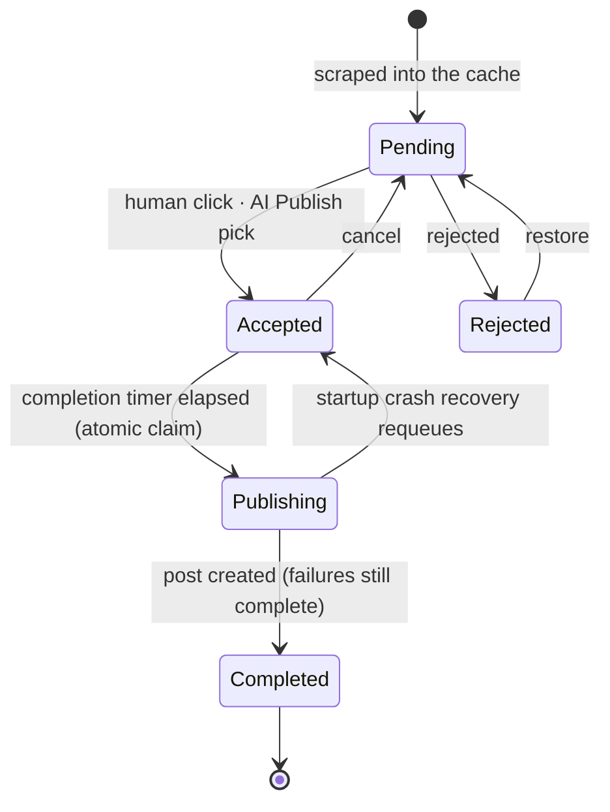
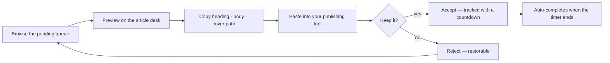

<p align="center">
  
</p>

<p align="center">
  
  
  
  
  
  
  
</p>

---

## ✨ What is News Flow?

**News Flow** is a self-hosted newsroom desk for Malayalam news. It scrapes your configured sources into a cached feed, and then hands the feed to whoever — or whatever — you want running the desk:

- 🤖 **The agent.** With a Gemini API key, an *AI Publish* curator periodically reads the pending queue, picks the most newsworthy stories, avoids duplicating anything recently accepted, and feeds them through the same pipeline as a human click. At publish time a second Gemini call files each article under the site's own WordPress categories. Completed articles are pushed to WordPress — featured image, formatted body, categories and all — automatically.
- 🖱️ **The human.** Without any AI credentials, News Flow is still a complete curation tool: a review workspace with a countdown queue, plus an article desk where the cover, heading and full body are one click away from your clipboard — copy the heading, copy the article, copy the image path, and paste it into whatever you publish with.

Both modes run side by side. A human operator can pair-publish with the agent all day: you accept what it missed, it accepts while you're away, and every article — picked by hand or by model — takes the exact same path to the queue, the timer, and (if publishing is on) WordPress.

### The life of an article



Only the head of the accepted queue runs its completion timer; articles queued behind it show **Waiting** until their turn. Accepted articles are never trimmed out of the cache — only untouched pending rows past the per-source cap are pruned.

---

## 🤖 The agentic layer

Two Gemini-powered features share one client (`app/gemini.py`), and both are hardened the same way: structured JSON output via response schemas, case-insensitive matching of the model's answer against **only** real IDs from your database, retries with backoff on 429/5xx, and fail-soft everywhere — an API error never takes the pipeline down.

### AI Publish — the curator

On a configurable interval (default: hourly), pending articles are offered to Gemini as a numbered list, along with the most recently accepted headings so the same story arriving from three sources gets picked once. The model returns up to *N* article IDs; each returned ID is matched back against the list that was offered, so a hallucinated ID can never accept a real article. Picked articles are accepted through the exact same status transition as the UI's button, then enriched and published like any other.

The UI shows a live countdown meter to the next prompt, and the settings modal exposes the knobs:

| Knob | Default | Meaning |
|------|---------|---------|
| Articles per prompt | `3` | How many articles Gemini picks each round |
| Prompt interval | `60 min` | Rest between rounds (floored at 30 s) |
| Duplicate-avoidance context | `10` | Recent accepted headings shown to the model |

### AI auto-categorization — the filing clerk

WordPress categories and tags are synced into the local database at startup and refreshed on a 24 h TTL, so Gemini always classifies against the *site's current* vocabulary. Right before an article is published, its heading, description and a trimmed body (360 chars) plus the synced category list go to Gemini; the response names are matched back to real WordPress category IDs and stamped onto the article. Tags feed the model as topic context — only categories are ever applied. When Gemini returns nothing, the post falls back to the default `WORDPRESS_CATEGORY_ID` (or the site default).

### Auto publishing — the press

Completed articles go out over the WordPress REST API with an application password: the downloaded cover is uploaded to `/wp-json/wp/v2/media` and attached as the featured image, the scraped body is escaped into `<p>` paragraphs, and the post is created with `status: publish`. Every step is fail-soft — a failed upload still publishes the post without an image, and a failed post still completes the article, with the reason recorded in the notification journal.

If the server dies mid-publish, startup recovery requeues any article left in `publishing`, so nothing is orphaned or double-posted.

---

## ✍️ Manual mode — publishing without AI

No API keys? News Flow is deliberately a complete tool without them. AI toggles simply show **Unavailable** in the settings modal until their environment variables exist, and the rest of the desk works as-is.

### The article desk

Every article has a dedicated page at `/article/{id}` — reach it via the **Preview** button on any card. It's built for keyboard-and-clipboard operators:

| Zone | Click to copy |
|------|---------------|
| 🖼️ Cover image | The web path of the downloaded cover (e.g. `/covers/kaumudi-123.jpg`) |
| 📰 Heading | The scraped headline, clean and newline-free |
| 📄 Article body | The full scraped text, ready for your editor |

Each click shows a toast confirmation; the **Read original article** link keeps the source one tab away for attribution. When a cover or body couldn't be scraped (some pages fight back), the desk says so instead of showing empty boxes.

### The manual loop



Accepting starts the article's completion countdown and locks in its place in the queue; rejecting parks it in a collapsible list you can restore from. With `auto_publish` off, completion is just bookkeeping — nothing leaves your machine.

---

## 🧭 The review workspace

A two-pane desk served at `/`:

- **Left** — the pending feed with per-source filter tabs and three switchable layouts: **grid** (cards), **rows** (thumbnail rows), and **compact** (dense list).
- **Right** — the working queue: accepted articles with live countdown meters, collapsible **Completed** and **Rejected** lists, one-click restore.
- **Top** — a notification bell with an unread badge (a persistent journal of every background event: refresh results, AI picks, Gemini hiccups, publish failures) and a settings modal that knows which features are actually available in your environment.

A background loop ticks every two seconds and drives everything scheduled: completion timers, the AI Publish curator, source refreshes, and the WordPress terms TTL. The browser never has to stay open.

Scraping notes worth knowing: Mangalam is a Next.js app whose pages sometimes render only a loading skeleton server-side, so its article pages go through Playwright; `/_next/image` wrappers are unwrapped to real image URLs; relative links are absolutized against each source's origin.

---

## 🚀 Quick Start

### Prerequisites

- Python 3.14+
- [uv](https://docs.astral.sh/uv/) package manager

### Installation

```bash
# Clone the repository
git clone https://github.com/your-username/news-flow.git
cd news-flow

# Install dependencies
uv sync

# Install Playwright's browser (needed for JS-rendered pages)
uv run playwright install chromium

# Configure (optional — see the tables below)
cp .env.example .env
```

### Running the App

```bash
uv run fastapi dev main.py
```

The desk will be available at **http://localhost:8000**.

> ℹ️ `uv run main.py` does **not** serve the app — `main.py` only defines the FastAPI object. Use `uv run fastapi dev main.py`.

---

## ⚙️ Configuration

### Environment (`.env`)

Everything AI-shaped is opt-in via environment variables; the app runs fine with none of them.

| Variable | Required for | Purpose |
|----------|--------------|---------|
| `WORDPRESS_URL` | Auto publishing | Site to publish to (no trailing slash) |
| `WORDPRESS_USERNAME` | Auto publishing | WordPress username |
| `WORDPRESS_APP_PASSWORD` | Auto publishing | Application password (wp-admin → Users → Profile) |
| `WORDPRESS_CATEGORY_ID` | — | Optional default category ID when Gemini picks none |
| `GEMINI_API_KEY` | AI Publish · Auto-categorization | [Get a key](https://aistudio.google.com/apikey) |
| `GEMINI_MODEL` | — | Optional; default `gemini-flash-lite-latest` (an alias that tracks the latest Flash-Lite release — chosen for its higher rate limits) |

Feature toggles (in the settings modal) can only be switched on when their backing credentials are present — the API refuses the write otherwise — and all default to on.

### App settings (editable in the UI)

| Setting | Default | Description |
|---------|---------|-------------|
| `completion_interval` | `600 s` | Time from accept to completion (and publish) per article |
| `refresh_interval` | `900 s` | Background re-scrape cadence (floored at 30 s) |
| `article_layout` | `grid` | Pending-list layout: `grid`, `rows`, or `compact` |
| `ai_publish_count` | `3` | Articles Gemini picks per prompt |
| `ai_publish_interval` | `3600 s` | Rest between AI Publish rounds (floored at 30 s) |
| `ai_publish_history` | `10` | Accepted headings fed to Gemini as dedupe context |

---

## 🔧 API Endpoints

| Method | Endpoint | Description |
|--------|----------|-------------|
| `GET` | `/` | The review workspace (HTML) |
| `GET` | `/article/{id}` | The article desk — cover, heading, body, click-to-copy |
| `GET` | `/api/scrape` | Cached articles as JSON (optional `?source=`) |
| `POST` | `/api/refresh` | Re-scrape sources and replace their cache (optional `?source=`) |
| `POST` | `/api/articles/{id}/accept` | Accept → enrich (cover + content) → completion queue |
| `POST` | `/api/articles/{id}/reject` | Reject an article |
| `POST` | `/api/articles/{id}/clear` | Return an article to pending |
| `GET` | `/api/settings` | Settings plus per-feature availability |
| `POST` | `/api/settings` | Update settings (validated against known keys) |
| `GET` | `/api/notifications` | The background-event journal, newest first |
| `DELETE` | `/api/notifications` | Clear the journal |

---

## 📰 Adding a Source

1. Create `app/scrapers/<source>.py` extending `BaseScraper` — implement `scrape()` for the listing page and `scrape_article_page()` for the article desk; set `needs_browser = True` if the pages need JavaScript.
2. Register it in `SCRAPERS` (`app/scrapers/init.py`) and add its URL to `SOURCES` (`app/config.py`). Scrapers must read sources via `SOURCES.get(name, fallback_url)` so a disabled source can't crash them.
3. Drop real listing/article HTML into `tests/fixtures/` and add offline tests against it.
4. Absolutize every article and image URL with `urljoin` before returning it — relative URLs never leave a scraper.

---

## 📁 Project Structure

```
news-flow/
├── main.py                     # FastAPI app, startup/shutdown, 2 s background loop
├── app/
│   ├── config.py               # SOURCES, timeouts, .env loading (WP + Gemini)
│   ├── models.py               # NewsItem, ScrapedArticleContent (pydantic)
│   ├── client.py               # httpx client singleton
│   ├── utils.py                # fetch_html, download_image, image unwrapping
│   ├── browser.py              # Playwright rendering for JS-heavy pages
│   ├── curator.py              # AI Publish: Gemini picks pending articles
│   ├── publisher.py            # WordPress posts + media uploads
│   ├── gemini.py               # Categorization + selection (structured output)
│   ├── wordpress.py            # Category/tag sync (TTL-refreshed)
│   ├── refresher.py            # Scheduled background source refresh
│   ├── scrapers/               # BaseScraper + one module per source
│   ├── routes/scrape.py        # API + UI routes, settings, notifications
│   └── db/                     # SQLAlchemy 2.0 (sync, wrapped in to_thread)
│       ├── engine.py           # SQLite WAL engine + run_in_thread helper
│       ├── schema.py           # create_all, migrations, daily reset
│       ├── articles.py         # Queries, atomic publish claims, queueing
│       ├── settings.py / wp_terms.py / notifications.py
│       └── constants.py        # Defaults, status flags, toggle gating
├── templates/                  # Jinja2 UI (base / index / article)
├── static/                     # Banner, logo, footer
├── public/                     # Downloaded covers + scraped article text
├── tests/                      # Offline suite + HTML fixtures
├── scripts/                    # Live smoke tests (see below)
└── pyproject.toml              # uv project config
```

---

## 🧪 Testing

The pytest suite is **fully offline** — scrapers run against local HTML fixtures in `tests/fixtures/`, HTTP is faked, and no test touches the network.

```bash
uv run pytest          # the verification gate
uv run pytest -v       # with names
```

Three manual scripts hit the real world when *you* choose to:

```bash
uv run python scripts/health_check.py [source ...]   # live scrape of listing + article + cover
uv run python scripts/publish_check.py               # WP terms sync + Gemini categorization
uv run python scripts/publish_check.py --publish     # also POST a draft, then delete it
uv run python scripts/publish_check.py --model       # ping the configured Gemini model
uv run python scripts/race_check.py                  # simulate the duplicate-publish race
```

---

## 🛠️ Under the hood

Design decisions that keep the autonomous parts trustworthy:

- **Fail-soft by contract.** Accept never fails because scraping did; a failed publish still completes the article; a Gemini 429 just skips a round. Every failure lands in the notification journal instead of an exception log nobody reads.
- **Stamp-before-work scheduling.** The refresher and the AI Publish curator record their attempt timestamp *before* making network calls, so a crashed call can't wedge the loop into a hot retry against rate limits.
- **Atomic publish claims.** Due articles are claimed (`status = publishing`) inside a `BEGIN IMMEDIATE` transaction — the background loop and a UI reload racing each other can never double-post. `scripts/race_check.py` proves it.
- **Grounded model output.** Every ID or category name Gemini returns is matched back against the lists the app actually offered; hallucinations are dropped, never acted on.
- **Sync where it's simple.** SQLAlchemy runs synchronously in worker threads (`asyncio.to_thread`), SQLite runs in WAL mode — boring, reliable, and correct for a single-node desk.
- **A clean slate every day.** On the first start of a new UTC day, the article table and the `public/` workspace are wiped, and requeued `publishing` rows are recovered. The desk is built for a daily news rhythm.

### Tech Stack

| Layer | Choice |
|-------|--------|
| Backend | FastAPI, SQLAlchemy 2.0, httpx |
| Scraping | BeautifulSoup4, Playwright |
| AI | Google Gemini (structured output, JSON schemas) |
| Database | SQLite (WAL mode) |
| Frontend | Jinja2, Tailwind CSS |
| Testing | pytest, pytest-asyncio |
| Tooling | uv |

---

## 📜 License

News Flow is released under the **Common-Sense License** — a custom license, fitting for a fully custom codebase.

This project was written end-to-end by an AI (Buffy, via Codebuff) at the direction of a human operator, so the license keeps the same spirit: simple, permissive, and honest. In short:

- **Use it** for anything — commercial, personal, educational, or the hobby project you abandon in three weeks
- **Modify it** freely; just don't pretend you wrote the original (keep a "Based on News Flow" notice)
- **Your changes are yours** — bugs you fix belong to you, bugs you introduce belong to you too
- **No warranty whatsoever** — it scrapes news sites; news sites change their markup at 2 a.m.; things will break

See the full text in [LICENSE](LICENSE).

---

<p align="center">
  
</p>
